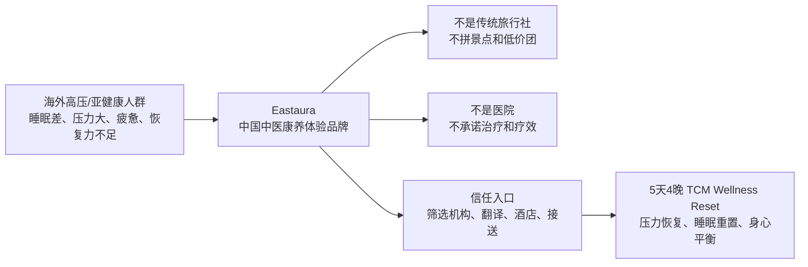
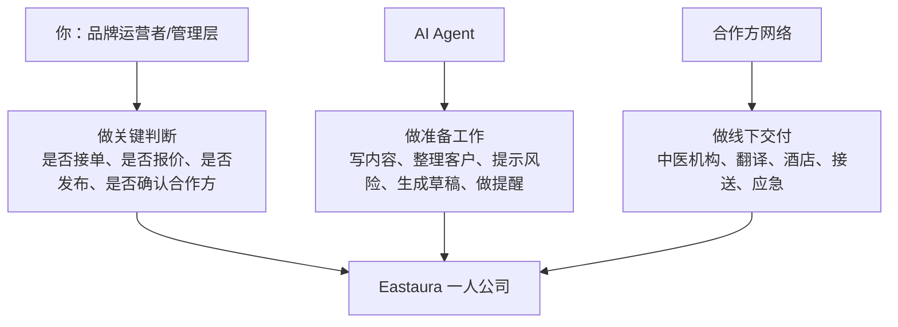
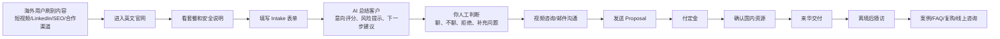
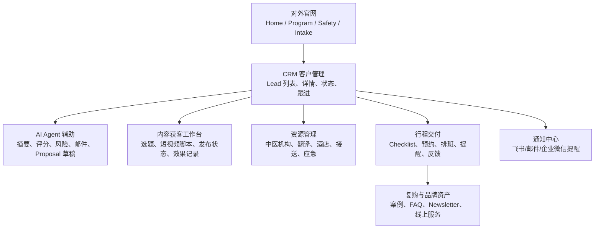
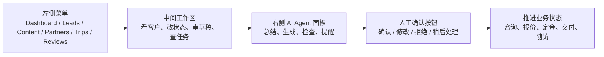
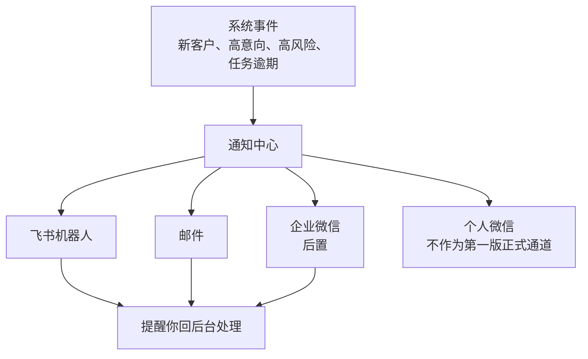

# Eastaura Project System Overview

## 1. 一句话定位

Eastaura 不是普通入境游，也不是医疗机构，而是面向海外人群的中国中医康养体验品牌。

核心模型：

```text
海外获客 -> 客户筛选 -> 人工判断 -> 国内资源整合 -> 来华交付 -> 复购和品牌资产
```

## 2. 商业定位图



## 3. 一人公司运转图



## 4. 客户旅程图



## 5. 系统模块图



## 6. 后台指挥台图



## 7. 通知机制图



## 8. 已确定与未确定

### 已确定

- 品牌方向：中医康养入境体验。
- 一人公司模式：Founder as trust owner, AI as operating system, partners as delivery network。
- 首期系统：官网、Intake、CRM、AI 辅助、通知、内容冷启动。
- AI 边界：做草稿和提醒，不做医疗判断、不自动接单。

### 待确认

- 首发城市。
- 核心客群国家。
- 价格区间。
- 合作机构标准。
- 套餐天数与服务明细。
- 退款/取消规则。
- 隐私政策和医疗边界文本。
- 视觉风格和品牌素材。
- 支付方式。
- 第一批获客渠道优先级。

